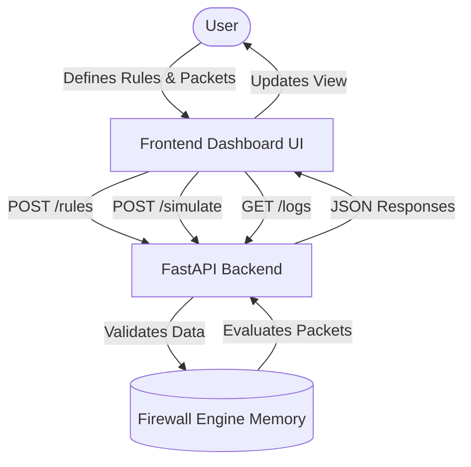
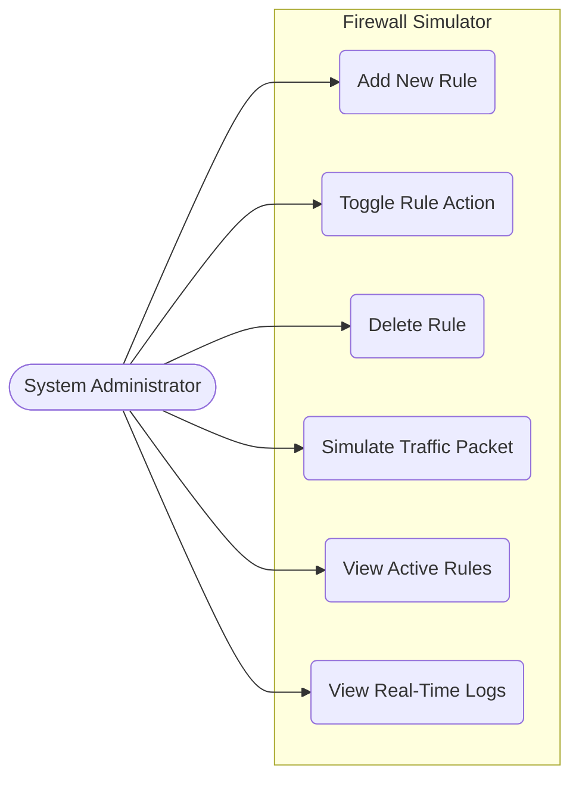
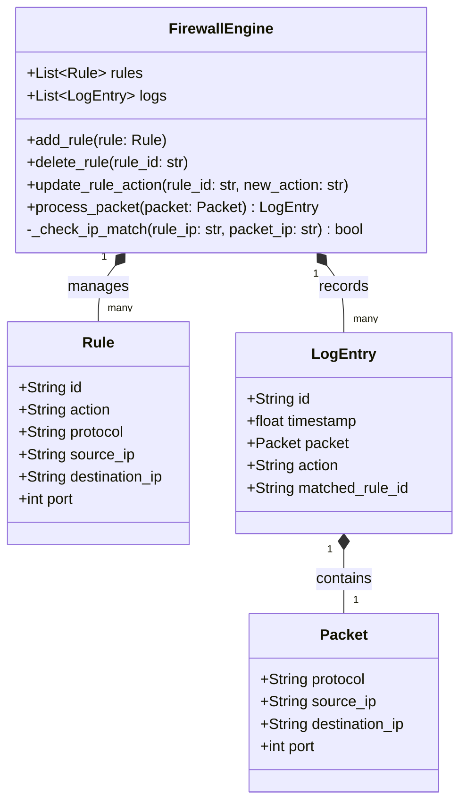
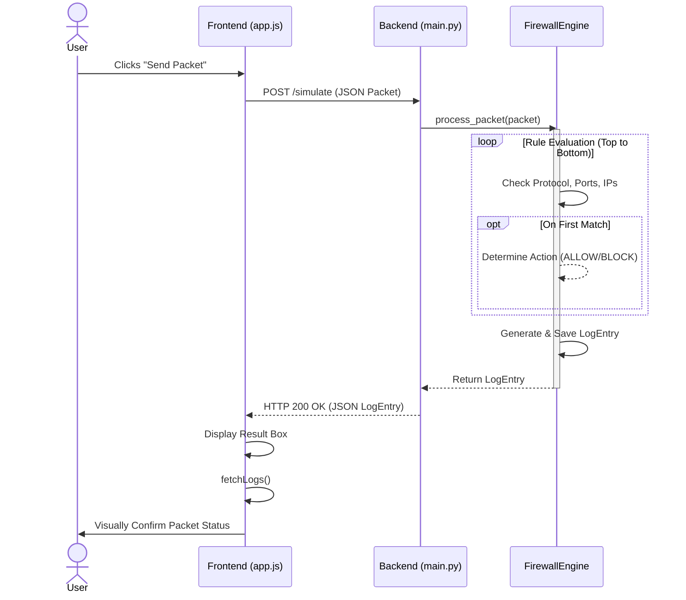
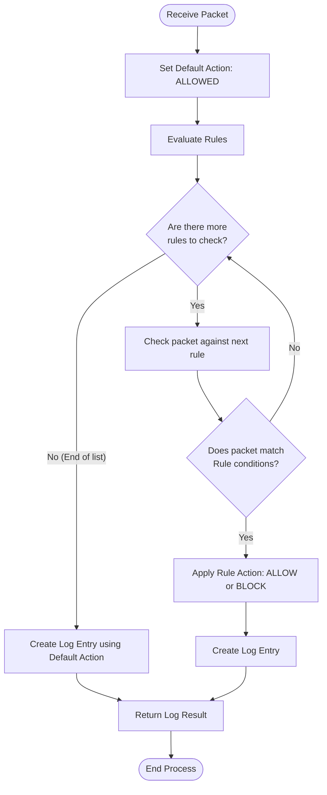
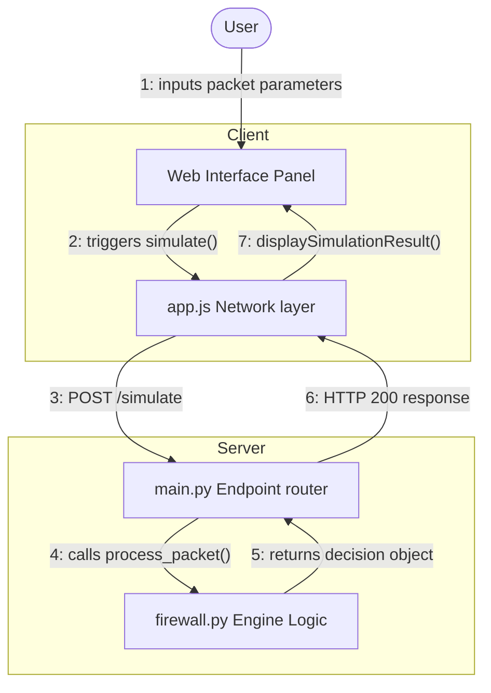
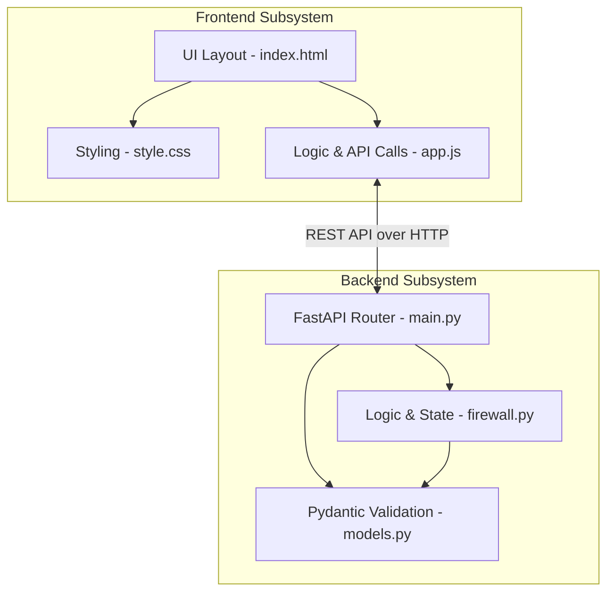
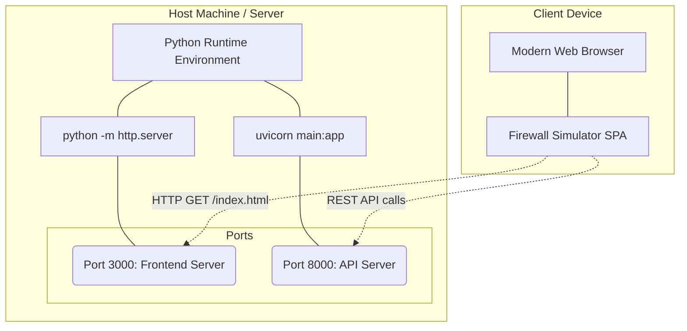

# Firewall Simulator - Architecture Diagrams

This document contains standardized UML and system diagrams illustrating the architecture, behavior, and logic structure of the Firewall Simulator project.

## 1. Data Flow Diagram (DFD - Level 1)

## 2. Use Case Diagram

## 3. Class Diagram

## 4. Sequence Diagram (Simulating Traffic)

## 5. Activity Diagram (Packet Processing Strategy)

## 6. Collaboration Diagram

## 7. Component Diagram

## 8. Deployment Diagram

